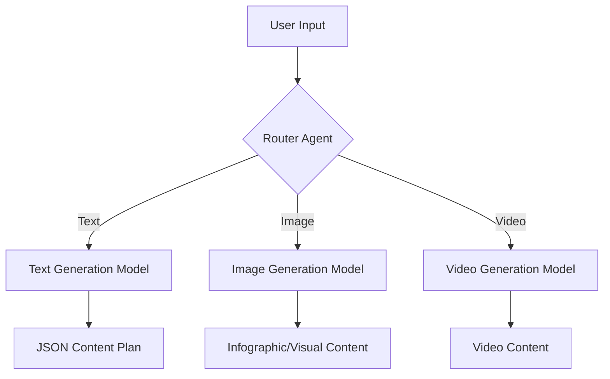

# Research Report: Hugging Face Models and Agentic AI for Content Creation App

## 1. Text Generation Models

Based on initial research, the following models are strong candidates for text generation, particularly for content planning and creative writing, with a focus on generating JSON output.

### 1.1. Instruction-Tuned Models

These models are trained to follow instructions, making them well-suited for generating structured output like JSON.

*   **[Mixtral 8x7B](https://huggingface.co/mistralai/Mixtral-8x7B-Instruct-v0.1):** A sparse mixture-of-experts model that is known for its high performance and efficiency. It is a strong candidate for generating high-quality content plans.
*   **[Llama 3](https://huggingface.co/meta-llama/Meta-Llama-3-70B-Instruct):** The latest version of the Llama family of models from Meta AI. It is a powerful model that has demonstrated state-of-the-art performance on a wide range of NLP tasks.
*   **[Cohere Command R+](https://huggingface.co/CohereForAI/c4ai-command-r-plus):** A powerful instruction-following model from Cohere, designed for enterprise-grade workloads. It is a strong contender for generating reliable and high-quality content.

### 1.2. Fine-Tuned Models for Specific Tasks

*   **[Flan-T5](https://huggingface.co/google/flan-t5-large):** A powerful language model that is particularly well-suited for generating structured data like JSON. There are several fine-tuned versions of Flan-T5 available on the Hugging Face Hub that are specifically designed for text-to-json tasks.
*   **[Bloom-1b7-creative-writing](https://huggingface.co/alonzogarbanzo/Bloom-1b7-creative-writing):** A fine-tuned version of the Bloom model that is specifically designed for creative writing tasks. This model could be useful for generating creative content ideas.

### 1.3. Next Steps

My next step is to conduct a more in-depth investigation of these models to determine which one is the best fit for the content creation app. I will focus on the following criteria:

*   **Performance:** How well does the model perform on text generation tasks, particularly for generating JSON content plans and creative writing?
*   **Accessibility:** How easy is it to access and use the model? Are there any restrictions on its use?
*   **Cost:** What are the costs associated with using the model?
*   **Integration:** How can the model be integrated into a Streamlit application? What are the specific APIs and libraries to use?

I will now proceed with a more detailed investigation of these models, starting with a search for benchmarks and comparisons.### 1.1. Instruction-Tuned Models

These models are trained to follow instructions, making them well-suited for generating structured output like JSON.

*   **[Mixtral 8x7B](https://huggingface.co/mistralai/Mixtral-8x7B-Instruct-v0.1):** A sparse mixture-of-experts model that is known for its high performance and efficiency. It is a strong candidate for generating high-quality content plans. According to the search results, it has a 32k context window and is a good all-around model. In terms of cost, it's more expensive than Llama 3 but cheaper than Command R+.

*   **[Llama 3](https://huggingface.co/meta-llama/Meta-Llama-3-70B-Instruct):** The latest version of the Llama family of models from Meta AI. It is a powerful model that has demonstrated state-of-the-art performance on a wide range of NLP tasks. Llama 3 is significantly cheaper than both Mixtral 8x7B and Command R+.

*   **[Cohere Command R+](https://huggingface.co/CohereForAI/c4ai-command-r-plus):** A powerful instruction-following model from Cohere, designed for enterprise-grade workloads. It is a strong contender for generating reliable and high-quality content, but it is also the most expensive of the three.

### 1.2. Fine-Tuned Models for Specific Tasks

*   **[Flan-T5](https://huggingface.co/google/flan-t5-large):** A powerful language model that is particularly well-suited for generating structured data like JSON. It is an instruction-tuned model that can be easily fine-tuned for specific tasks. Several resources indicate its effectiveness for JSON generation.

*   **[Bloom-1b7-creative-writing](https://huggingface.co/alonzogarbanzo/Bloom-1b7-creative-writing):** A fine-tuned version of the Bloom model that is specifically designed for creative writing tasks. This model could be useful for generating creative content ideas, but may not be the best choice for generating structured JSON output.

### 1.3. Integration with Streamlit

The Hugging Face Hub provides a simple API for running inference on their models. The following Python code demonstrates how to use the `huggingface_hub` library to generate text with a specified model:

```python
import streamlit as st
from huggingface_hub import InferenceClient

client = InferenceClient()

def generate_text(prompt, model="mistralai/Mixtral-8x7B-Instruct-v0.1"):
    response = client.text_generation(prompt, model=model, max_new_tokens=1024)
    return response

st.title("AI Content Generator")

prompt = st.text_input("Enter a prompt:")

if st.button("Generate"):
    generated_text = generate_text(prompt)
    st.write(generated_text)
```

This code can be easily adapted to use any of the models listed above. To generate JSON, the prompt should be carefully crafted to instruct the model to return the output in the desired format.
## 2. Image Generation Models

For image generation, particularly for infographics and visual content, there are several powerful models available on the Hugging Face Hub. The most popular and effective models are based on diffusion techniques, such as Stable Diffusion.

### 2.1. Text-to-Image Models

These models generate images from a text prompt. They are ideal for creating a wide variety of visual content, from realistic photos to artistic illustrations.

*   **[Stable Diffusion XL (SDXL)](https://huggingface.co/stabilityai/stable-diffusion-xl-base-1.0):** The latest and most powerful version of the Stable Diffusion model. It is capable of generating high-resolution images with a high degree of realism and detail.

*   **[DALL-E 3](https://huggingface.co/dall-e-3):** While not directly available on the Hub for inference, DALL-E 3 is a powerful text-to-image model from OpenAI that can be accessed through their API. It is known for its ability to generate creative and high-quality images.

### 2.2. Specialized Models

In addition to general-purpose text-to-image models, there are also a number of specialized models that are designed for specific tasks, such as generating infographics or other types of visual content.

*   **[Pix2Struct](https://huggingface.co/google/pix2struct-infographics-vqa-large):** A model from Google that is specifically designed for understanding and generating infographics. It can be used to generate infographics from scratch, or to answer questions about existing infographics.

### 2.3. Integration with Streamlit

Similar to text generation, the Hugging Face Hub provides a simple API for running inference on image generation models. The following Python code demonstrates how to use the `huggingface_hub` library to generate an image with a specified model:

```python
import streamlit as st
from huggingface_hub import InferenceClient
from PIL import Image
import io

client = InferenceClient()

def generate_image(prompt, model="stabilityai/stable-diffusion-xl-base-1.0"):
    response = client.text_to_image(prompt, model=model)
    return response

st.title("AI Image Generator")

prompt = st.text_input("Enter a prompt:")

if st.button("Generate"):
    generated_image_data = generate_image(prompt)
    image = Image.open(io.BytesIO(generated_image_data))
    st.image(image, caption="Generated Image")

```

This code can be easily adapted to use any of the text-to-image models listed above. For generating infographics, it may be necessary to use a more specialized model like Pix2Struct, which may require a different integration approach.
## 3. Video Generation Models

The field of video generation is rapidly evolving, and there are several promising models available on the Hugging Face Hub. These models can be used to generate short video clips from text prompts.

### 3.1. Text-to-Video Models

*   **[ModelScopeT2V](https://huggingface.co/ali-vilab/modelscope-damo-text-to-video-synthesis):** A text-to-video synthesis model that is based on Stable Diffusion. It is one of the most popular open-source text-to-video models available.

*   **[ZeroScope_v2](https://huggingface.co/cerspense/zeroscope_v2_576w):** Another popular text-to-video model that is known for its ability to generate high-quality videos.

*   **[SVD: Stable Video Diffusion](https://huggingface.co/stabilityai/stable-video-diffusion-img2vid-xt):** A latent diffusion model for high-resolution, image-to-video and text-to-video generation.

### 3.2. Integration with Streamlit

Video generation models can be integrated into a Streamlit application using the `diffusers` library. The following Python code demonstrates how to generate a video from a text prompt using the `ModelScopeT2V` model:

```python
import streamlit as st
import torch
from diffusers import DiffusionPipeline, DPMSolverMultistepScheduler
from diffusers.utils import export_to_video

# Load the model
pipe = DiffusionPipeline.from_pretrained("ali-vilab/modelscope-damo-text-to-video-synthesis", torch_dtype=torch.float16)
pipe.scheduler = DPMSolverMultistepScheduler.from_config(pipe.scheduler.config)
pipe.enable_model_cpu_offload()

def generate_video(prompt):
    video_frames = pipe(prompt, num_inference_steps=25).frames
    video_path = export_to_video(video_frames)
    return video_path

st.title("AI Video Generator")

prompt = st.text_input("Enter a prompt:")

if st.button("Generate"):
    video_path = generate_video(prompt)
    st.video(video_path)
```
**Note:** Video generation is a computationally intensive task and may require a GPU to run effectively.
## 4. Agentic AI Patterns

Agentic AI is a powerful paradigm for building complex AI systems that can reason and act autonomously. For the content creation app, an agentic AI architecture can be used to route different content types to the appropriate generative models. This section outlines a proposed architecture based on the **Router** or **Dispatcher** pattern.

### 4.1. Router (Dispatcher) Pattern

The Router pattern is a common agentic AI design pattern that is used to intelligently route tasks to different agents or tools based on the nature of the task. In the context of the content creation app, a router agent can be used to analyze the user's input and determine which type of content to generate (e.g., text, image, or video). Once the content type has been determined, the router can then forward the task to the appropriate generative model.

### 4.2. Proposed Architecture

The following diagram illustrates a proposed architecture for the content creation app based on the Router pattern:



**Explanation:**

1.  **User Input:** The user provides a high-level description of the content they want to create, including the client type (e.g., accountant, chef, artist).
2.  **Router Agent:** The router agent analyzes the user's input and the generated JSON content plan to determine which type of content to generate. It can be a simple rule-based system or a more sophisticated language model that is trained to classify content types.
3.  **Generative Models:** Once the content type has been determined, the router agent forwards the task to the appropriate generative model (e.g., text generation, image generation, or video generation).
4.  **Output:** The generative models produce the desired content, which is then presented to the user.

### 4.3. Implementation

The router agent can be implemented as a simple Python function that uses a set of rules to classify the content type. For example, if the JSON content plan contains a key called `"infographic"`, the router can forward the task to the image generation model. Alternatively, a more sophisticated approach would be to use a language model to classify the content type. This would allow for more flexibility and could be trained to handle a wider variety of content types.

Here is a simplified Python code example of a router agent:

```python
import json

def route_content(content_plan):
    """Routes the content plan to the appropriate generative model."""
    data = json.loads(content_plan)
    if "infographic" in data:
        return "image_generation"
    elif "video_script" in data:
        return "video_generation"
    else:
        return "text_generation"

# Example usage:
content_plan = '{"day": 1, "content_idea": "A blog post about tax tips for small businesses.", "infographic": "A diagram showing the different types of business structures."}'

content_type = route_content(content_plan)

print(f"Routing to: {content_type}")
```

This is a simplified example, and a more robust implementation would require more sophisticated logic for classifying content types. However, it demonstrates the basic principle of the router pattern.
## 5. System Architecture and Recommendations

This section provides a recommended system architecture for the content creation app, as well as recommendations for the best models and integration approaches to use.

### 5.1. Recommended System Architecture

The recommended system architecture is based on a microservices approach, with each component of the system running as a separate service. This will allow for greater scalability and flexibility, and will make it easier to update and maintain the system over time.

```mermaid
graph TD
    A[User Interface (Streamlit)] --> B[API Gateway];
    B --> C{Content Generation Service};
    C -- Text --> D[Text Generation API];
    C -- Image --> E[Image Generation API];
    C -- Video --> F[Video Generation API];
```

**Components:**

*   **User Interface (Streamlit):** The front-end of the application, where users can input their requirements and view the generated content.
*   **API Gateway:** A single point of entry for all API requests. The API gateway will route requests to the appropriate microservice.
*   **Content Generation Service:** The core of the application, which contains the business logic for generating content. This service will be responsible for calling the appropriate generative models and for formatting the output.
*   **Generative Model APIs:** A set of APIs that provide access to the generative models. These APIs can be either hosted on the Hugging Face Hub or self-hosted.

### 5.2. Model Recommendations

*   **Text Generation:** **Llama 3** is the recommended model for text generation, due to its high performance and relatively low cost. For generating structured JSON output, it is recommended to fine-tune the model on a dataset of JSON content plans.

*   **Image Generation:** **Stable Diffusion XL (SDXL)** is the recommended model for image generation. It is a powerful model that is capable of generating high-quality images with a high degree of realism and detail.

*   **Video Generation:** **SVD: Stable Video Diffusion** is the recommended model for video generation. It is a powerful model that is capable of generating high-quality videos.

### 5.3. Integration Recommendations

*   **Hugging Face Hub:** The Hugging Face Hub is the recommended platform for hosting and running the generative models. It provides a simple and easy-to-use API for running inference on a wide variety of models.

*   **Streamlit:** Streamlit is the recommended framework for building the user interface. It is a simple and easy-to-use framework that is well-suited for building data-driven applications.

## 6. Conclusion

This report has provided a comprehensive overview of the Hugging Face models and agentic AI architectures that can be used to build a content creation app. The report has identified the best models for text, image, and video generation, and has provided a recommended system architecture for the app. By following the recommendations in this report, it is possible to build a powerful and scalable content creation app that can generate a wide variety of high-quality content.